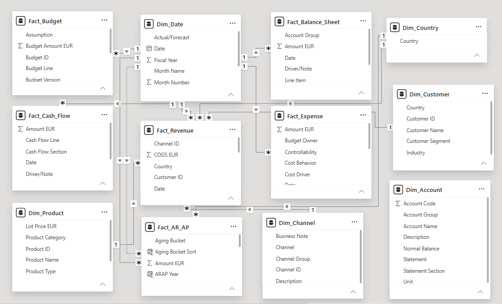
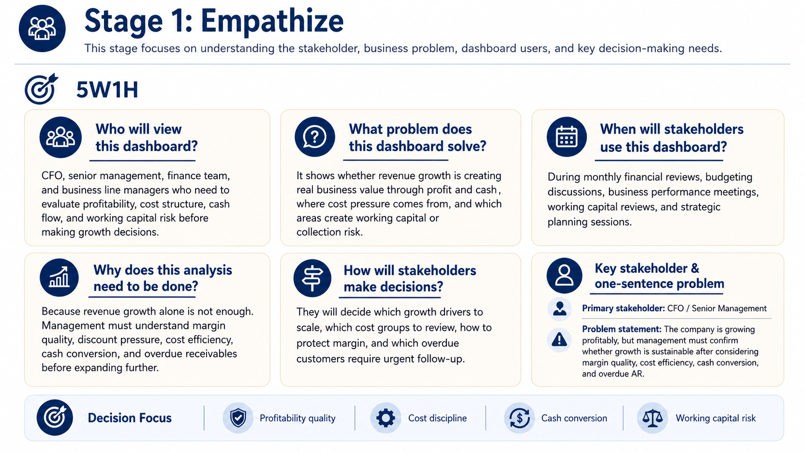
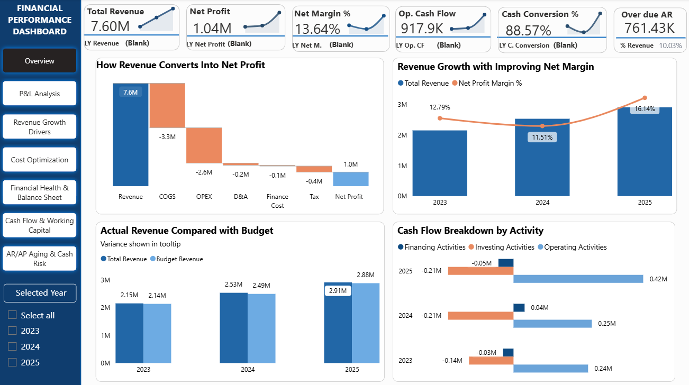

# Financial Statement Analysis Dashboard | German Market Case Study
## Table of Contents

- [1. Project Overview](#1-project-overview)
- [2. Business Problem](#2-business-problem)
- [3. Report Audience](#3-report-audience)
- [4. Dataset and Data Model](#4-dataset-and-data-model)
  - [4.1 Data Model](#41-data-model)
  - [4.2 Finance Control Checks](#42-finance-control-checks)
- [5. Design Thinking Process](#5-design-thinking-process)
  - [Empathize](#empathize)
  - [Empathy Map](#empathy-map)
  - [North Star Metric and Define POV](#north-star-metric-and-define-pov)
- [6. Dashboard Insights](#6-dashboard-insights)
  - [6.1 Executive Overview](#61-executive-overview)
  - [6.2 P&L Analysis](#62-pl-analysis)
  - [6.3 Revenue Growth Drivers](#63-revenue-growth-drivers)
  - [6.4 Cost Optimization](#64-cost-optimization)
  - [6.5 Financial Health and Balance Sheet](#65-financial-health-and-balance-sheet)
  - [6.6 Cash Flow and Working Capital](#66-cash-flow-and-working-capital)
  - [6.7 AR/AP and Cash Risk](#67-arap-and-cash-risk)
- [7. Executive Summary](#7-executive-summary)
- [8. Business Recommendations](#8-business-recommendations)
  - [8.1 Grow selectively in proven revenue engines](#81-grow-selectively-in-proven-revenue-engines)
  - [8.2 Introduce a controlled discount approval policy](#82-introduce-a-controlled-discount-approval-policy)
  - [8.3 Optimize costs through productivity, not broad cost cutting](#83-optimize-costs-through-productivity-not-broad-cost-cutting)
  - [8.4 Strengthen AR collection and credit control](#84-strengthen-ar-collection-and-credit-control)
  - [8.5 Use the strong cash position carefully](#85-use-the-strong-cash-position-carefully)
- [9. Final Conclusion](#9-final-conclusion)
  
## 1. Project Overview

This project analyzes the financial performance of **EuroFit Workplace Solutions GmbH**, a synthetic company operating in the German and European workplace solutions market.

The dataset covers monthly financial data from **2023 to 2025** and includes income statement, balance sheet, cash flow, budget, accounts receivable, and accounts payable data.

The dashboard focuses on financial statement analysis to help management understand whether business growth is translating into profit, cash flow, and a healthy financial position.

The reporting currency is **EUR**.

## 2. Business Problem

The company is growing, but management needs to understand whether this growth creates real financial value.

The key business question is:

> Is revenue growth translating into profit, cash flow, and a healthy financial position?

To answer this question, the dashboard focuses on:

- How revenue changes over time
- Whether gross margin and operating profit are healthy
- Which cost areas put pressure on profitability
- How assets, liabilities, and equity change over time
- Whether profit is converted into operating cash flow
- Whether AR/AP and working capital create financial risk

## 3. Report Audience

This dashboard is designed for the management team, especially:

- CEO / Founder
- CFO / Finance Manager
- COO
- Commercial Director

The report supports decisions related to growth, profitability, cost control, cash flow, working capital, and financial planning.

## 4. Dataset and Data Model

The dataset is a synthetic financial dataset covering monthly data from **2023 to 2025**. It includes revenue, expenses, balance sheet, cash flow, budget, and AR/AP data.

### 4.1 Data Model

The data model mainly uses **Dim_Date** as the central time dimension. Product, channel, and customer fields support revenue analysis, while financial statement tables are analyzed through their own reporting line fields such as cost group, line item, cash flow line, budget line, and aging bucket.

The relationship view below shows the final Power BI data model.

 

### 4.2 Finance Control Checks

Before building the dashboard, several finance logic checks were applied to ensure that the analysis is financially consistent and explainable.

| Control Check | Logic | Purpose | Result |
|---|---|---|---|
| Gross Profit Check | Gross Profit = Revenue - COGS | Validate core P&L calculation logic | Passed |
| EBITDA Check | EBITDA = Revenue - COGS - Operating Expenses | Ensure EBITDA is derived consistently from operating drivers | Passed |
| Net Profit Check | Net Profit = EBITDA - D&A - Finance Cost - Tax | Validate profit conversion from operating profit to bottom-line profit | Passed |
| EBITDA Variance Check | EBITDA Variance = Revenue Impact + COGS Saving + OPEX Saving | Ensure budget variance is explained by key financial drivers | Passed |
| AR Definition Check | Late & Overdue AR = paid-late AR + currently overdue open AR | Avoid confusion between historical late collection exposure and current open AR | Passed |

## 5. Design Thinking Process

The dashboard was designed using a Design Thinking approach to clarify the target users, business pain points, key decision metrics, and dashboard direction before building visuals in Power BI.

### Empathize

### Empathy Map

### North Star Metric and Define POV

## 6. Dashboard Insights

This dashboard follows a decision-oriented and insight-driven approach. Instead of only reporting financial results, each page is designed to answer a specific management question: whether the company is growing profitably, where growth comes from, which costs should be reviewed, whether the balance sheet can support expansion, and which working capital risks require action. The dashboard is structured from a high-level financial overview to detailed analysis of profitability, revenue growth, cost structure, balance sheet health, cash flow, and AR/AP risk.

### 6.1 Executive Overview

The Executive Overview page answers the question: **Is the company growing in a financially healthy way?**

The company shows positive financial growth, with total revenue reaching **€7.60M** and net profit reaching **€1.04M**. Net margin improved in 2025, which shows that revenue growth is being converted into profit more effectively than in previous years. Operating cash flow remained positive, suggesting that the company is not only profitable on paper but is also generating cash from its core business. However, late & overdue AR reached **€761.3K**, equal to **10.03% of revenue**, creating a working capital risk because part of the company’s revenue has not been collected on time. Therefore, management should continue supporting growth, but should avoid expanding too aggressively until collection performance improves.

### 6.2 P&L Analysis

The P&L Analysis page answers the question: **Is profitability improving because of real operating efficiency or only because of revenue growth?**

Profitability improved mainly because the company controlled costs better than planned. Revenue was slightly above budget by **1.1%**, while COGS was **8.5% lower than budget** and OPEX was **8.3% lower than budget**. As a result, EBITDA reached **€1.70M**, exceeding budget by **58.7%**, with an EBITDA margin of **22.36%**. The EBITDA variance bridge shows that the outperformance was mainly driven by COGS savings and OPEX savings, rather than revenue growth alone, which means that the company is not only growing, but also converting revenue into profit more efficiently. However, COGS and OPEX still absorb a large share of revenue, so management should protect gross margin and review major cost groups such as Payroll and Sales & Marketing. The key decision is to understand whether current cost savings are sustainable before using this profit improvement as a basis for aggressive expansion.

### 6.3 Revenue Growth Drivers

The Revenue Growth Drivers page answers the question: **Where does revenue growth come from, and is it scalable without damaging margin quality?**

Revenue growth is positive, with a **16.24% CAGR from 2023 to 2025** and a gross profit margin of **56.72%**. Growth is mainly driven by Germany, which generated **€5.1M**, and by Hardware, which contributed **€5.9M**. Direct Sales is the largest channel, contributing **€2.7M**. These results show that the company has clear growth engines. However, discount increased to **8.36%**, which suggests that part of the growth may depend on stronger discounting. Management should continue investing in the main growth drivers, but should also monitor margin quality by market, product, and channel. The key decision is not only to grow revenue, but to identify which growth drivers can scale profitably without relying too much on discounts.

### 6.4 Cost Optimization

The Cost Optimization page answers the question: **Which costs should management review first, and how can the company optimize costs without weakening growth capacity?**

OPEX increased in absolute value, but cost efficiency improved because OPEX represented **34.36% of revenue**. However, **89.24% of OPEX** is classified as reviewable cost, meaning there is still significant room for optimization. Payroll and Sales & Marketing together account for more than **66% of total OPEX**, so these areas should be the main focus of management review. The goal should not be broad cost cutting, because Payroll and Sales & Marketing may directly support future growth. Instead, the company should use productivity-based optimization through payroll productivity, sales ROI, customer acquisition cost, and channel efficiency. Management should also review IT & Software for unused licenses or overlapping tools, and Bad Debt Expense for collection discipline.

### 6.5 Financial Health and Balance Sheet

The Financial Health and Balance Sheet page answers the question: **Does the company have enough financial strength to support future growth?**

The company’s financial position is strong and becoming healthier over time. Total assets increased from **€1.49M in 2023** to **€2.19M in 2025**, while equity grew to **€1.69M**. This suggests that business growth is mainly supported by retained earnings rather than heavy debt. Liquidity is very comfortable, with current assets of **€1.40M** compared with current liabilities of only **€0.09M**, resulting in a current ratio of **15.73**. Debt-to-equity decreased to **0.30**, showing low financial leverage and limited dependency on borrowing. The key decision is how to use the strong cash position efficiently without weakening the company’s low-risk balance sheet. Management should decide whether to keep excess cash for safety, use it to support controlled expansion, or invest in higher-return activities such as automation, productivity improvement, or collection systems.

### 6.6 Cash Flow and Working Capital

The Cash Flow and Working Capital page answers the question: **Is profit being converted into cash, or is working capital absorbing cash as the company grows?**

The company generates positive cash flow from its core business, but profit is not fully converted into cash. In 2025, operating cash flow increased to **€421.3K**, while net income was **€469.4K**, resulting in a cash conversion rate of **88.57%**. This means the company is profitable, but part of the profit is still tied up in working capital instead of being collected as cash. Working capital impact remained negative and reached **-€104.4K in 2025**, suggesting that receivables, inventory, or other working capital items are absorbing cash as the company grows. Management should improve cash collection and working capital discipline instead of focusing only on profit growth. The business has enough cash to support growth, but stronger working capital control is needed to make growth financially sustainable.

### 6.7 AR/AP and Cash Risk

The AR/AP and Cash Risk page answers the question: **Which receivables or payables create the most immediate cash risk?**

Receivables are the main working capital risk, while payables remain limited. Open AR is **€87.08K**, but late & overdue AR reached **€761.43K**, equal to **10.03% of total revenue**. Some overdue receivables are concentrated in high-risk customers such as **Berlin Creative Hub** and **Saxony Startup Studio**. Since open AP exposure is small, the company does not appear to face major short-term supplier payment pressure. Therefore, management should focus more on AR collection than AP management. The priority is to escalate high-risk overdue customers, hold further credit orders where necessary, and tighten payment terms for customers with repeated delays. The key decision is to protect cash flow by collecting overdue receivables faster before allowing more sales on credit.

## 7. Executive Summary

EuroFit Workplace Solutions GmbH is growing profitably and has a strong financial position, but the company should focus on improving the quality and sustainability of growth before expanding aggressively. Total revenue reached **€7.60M**, while net profit reached **€1.04M** and net margin improved, showing that revenue growth is being converted into profit more effectively. EBITDA performance is strong, mainly supported by cost control, with EBITDA reaching **€1.70M** and exceeding budget by **58.67%**.

Revenue growth is mainly driven by **Germany, Hardware, and Direct Sales**, which shows clear growth engines for the business. However, growth is concentrated in a few markets and product categories. Discount pressure is increasing, and overdue AR accounts for **10.03% of revenue**. This means the business is profitable, but part of its revenue is not being converted into cash on time.

Therefore, the key management priority should be **controlled profitable growth**. The company should continue investing in high-performing segments, protect gross margin, improve collection discipline, and optimize reviewable costs instead of simply pushing more revenue.

## 8. Business Recommendations

The recommended strategy is **controlled profitable growth**. The company should continue growing, but not by pushing revenue at all costs. Growth should be prioritized only in segments that can generate stable margin, controlled discount, and healthy cash collection.

### 8.1 Grow selectively in proven revenue engines

Management should continue investing in **Germany, Hardware, and Direct Sales** because these are the strongest revenue drivers. However, expansion should be linked to margin quality and cash collection performance.

A practical rule is to increase sales and marketing budget for a segment only when it meets three conditions: revenue is growing, gross margin is stable or improving, and overdue AR remains below the company’s risk threshold. If a segment generates high revenue but also requires heavy discounting or creates overdue receivables, management should avoid scaling it too aggressively.

### 8.2 Introduce a controlled discount approval policy

The company should avoid using discount as the main growth tool. Discount can support sales, but if it becomes the default method to win customers, it may weaken gross margin and reduce long-term profitability.

A practical discount policy could be:

- Discounts below **5%** can be approved by the sales team.
- Discounts between **5% and 8%** require approval from the Sales Manager or Head of Growth.
- Discounts above **8%** should only be approved for strategic customers with healthy margin, strong payment history, and no overdue AR.
- Customers with overdue AR should not receive additional discount or new credit terms until payment issues are resolved.

### 8.3 Optimize costs through productivity, not broad cost cutting

On the cost side, the focus should be productivity-based optimization rather than broad cost cutting, especially for **Payroll** and **Sales & Marketing**. These two cost groups are large, but they may also be important for future growth.

Payroll should be reviewed through metrics such as revenue per employee, gross profit per employee, workload, and automation potential. Sales & Marketing should be reviewed through ROI, customer acquisition cost, conversion rate, and revenue by campaign or channel. IT & Software should be reviewed for unused licenses, overlapping tools, or subscriptions that no longer support the business. Bad Debt Expense should be linked directly to credit control and collection performance.

The purpose is not to reduce costs blindly, but to remove waste while protecting the company’s ability to grow.

### 8.4 Strengthen AR collection and credit control

The most urgent risk is overdue AR. The company should implement a risk-based collection policy, hold further credit orders for high-risk overdue customers, and tighten payment terms for customers with repeated delays.

A practical AR collection policy could be:

- Before due date: send automatic payment reminders 3–5 days before the invoice is due.
- 1–30 days overdue: send a formal reminder and request a confirmed payment date.
- 31–60 days overdue: escalate to Finance or Account Management and hold further credit orders if there is no payment plan.
- More than 60 days overdue: require partial prepayment or full prepayment for new orders.
- Repeated late payers: reduce credit limit or change payment terms from 30 days to 14 days or upfront deposit.

For the current dashboard, customers such as **Berlin Creative Hub** and **Saxony Startup Studio** should be treated as high-priority collection cases.

### 8.5 Use the strong cash position carefully

Since the balance sheet and cash position are strong, the company has room to grow. However, cash should only be deployed into expansion after confirming that growth can be converted into profit and cash sustainably.

A practical cash allocation rule is to keep a minimum cash reserve equal to **3–6 months of fixed operating costs**. Any excess cash can then be used for controlled expansion, automation, collection systems, productivity improvement, or high-margin product lines. The company should avoid using cash for aggressive expansion if overdue AR and discount pressure are not under control.

## 9. Final Conclusion

This dashboard supports a **decision-oriented financial management approach**. It does not only show what happened in the business, but also explains why the results matter and what management should do next.

The overall conclusion is that EuroFit Workplace Solutions GmbH should follow a **controlled profitable growth strategy**: grow selectively, protect margin, optimize cost productivity, and convert profit into cash faster. The company is financially healthy and has room to grow, but expansion should be disciplined. Management should invest in high-performing segments only when growth is supported by healthy margin, controlled discount, and reliable cash collection.

